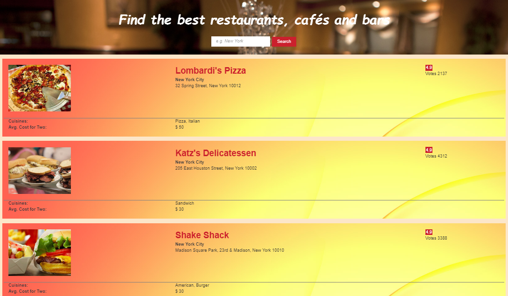
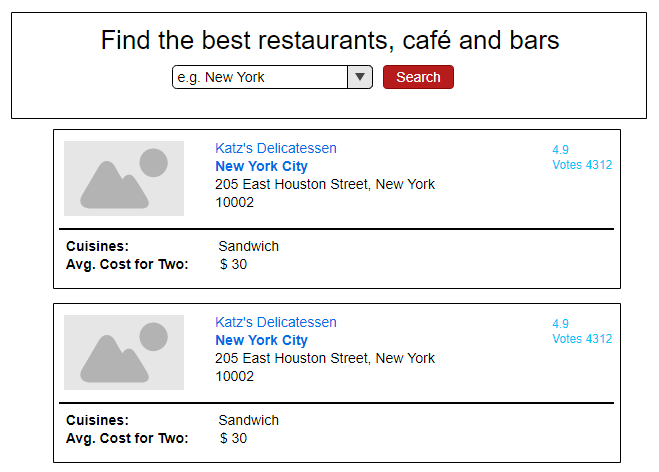
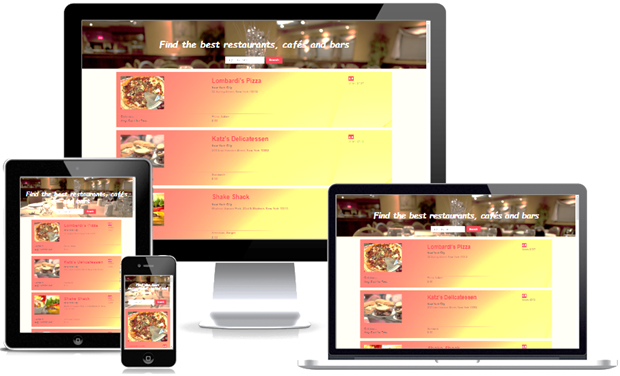

https://surbhiguptasai.github.io/CapstoneProject/
<h1>Restaurant Searcher</h1>
<p><a href="https://surbhiguptasai.github.io/CapstoneProject/">Restaurant Searcher</a> is a responsive  app that combines data from <a href="https://developers.google.com/maps/">Google Maps API</a> and <a href="https://developers.zomato.com/api">Zomato API</a> to give users ability to search restaurant near any location..</p>


## Features ##

Users can:

- Search restaurant near any location
- Get links to restaurant websites that have further details about menu, timings etc.
- Get restaurant ratings that help the user in picking a restaurant of their choice.
- Get average cost and Cuisine details to users that help users for their restaurant choice.


## Getting started
### Installing
```
>   git clone `
>   cd CapstoneProject
```
### Launching
Open index.html in a browser.

<h2>WireFrames</h2>
<p>Initial wireframes were created for each page. Mockups of all key processes were designed with user flow in mind.</p>
<p align="center"></p>

<h2>Technology & API</h2>
<ul>
  <li>HTML5</li>
  <li>CSS3</li>
  <li>JavaScript</li>
  <li>jQuery</li>
  <li>Ajax</li>
  <li>Google Maps</li>
  <li>Zomato</li>
</ul>


<h3>Responsive</h3>
<ul>
  <p>The app is fully responsive and quickly adapts to all mobile, tablet, and desktop viewports.</p>
</ul>
<p align="center"></p>

