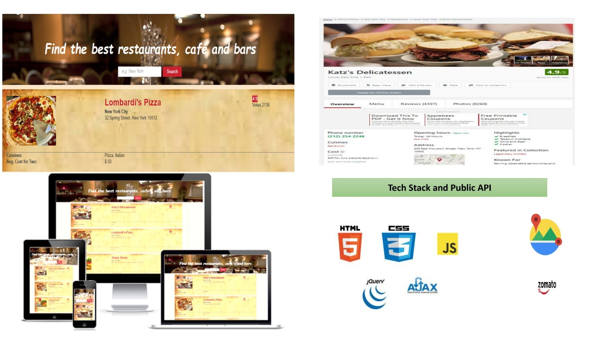
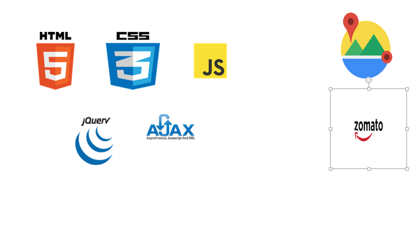

<h1>Restaurant Searcher</h1>
<p><a href="https://surbhiguptasai.github.io/CapstoneProject/">Restaurant Searcher</a> is a responsive  app that combines data from <a href="https://developers.google.com/maps/">Google Maps API</a> and <a href="https://developers.zomato.com/api">Zomato API</a> to give users ability to search restaurant near any location..</p>


## Getting started
### Installing
```
>   git clone https://github.com/surbhiguptasai/CapstoneProject.git
>   cd CapstoneProject
>   npm install
```
### Launching
```
>   npm start
```
Then open [`localhost:8000`](http://localhost:8000) in a browser.
### Testing
```
>   npm run test
```

<h2>Introduction</h2>
<p>The main focus of Restaurant Searcher is to help users find restaurants. It provides links to restaurant websites that have further details about menu, timings etc.
</p>

<h2>How it Works</h2>
<p>It combines  data from Google Maps and Zomato to give users ability to search restaurant near any location.</p>
<h2>Wireframes</h2>
<p>Initial wireframes were created for each page. Mockups of all key processes were designed with user flow in mind.</p>


<h2>Technology & API</h2>
<ul>
  <li>HTML5</li>
  <li>CSS3</li>
  <li>JavaScript</li>
  <li>jQuery</li>
  <li>Ajax</li>
  <li>Google Maps</li>
  <li>Zomato</li>
</ul>



<h3>Responsive</h3>
<ul>
  <li>The app is fully responsive and quickly adapts to all mobile, tablet, and desktop viewports.</li>
</ul>


